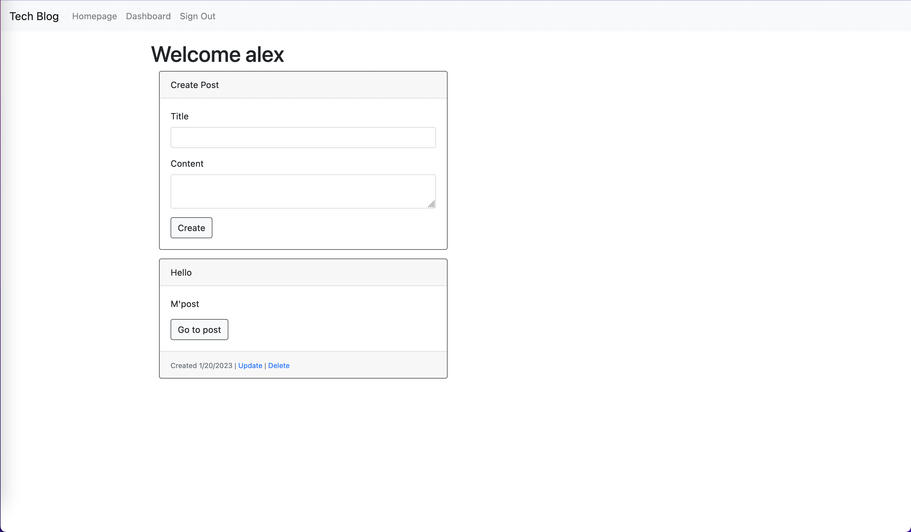

# Tech Blog

## Description
A CMS style blog site where a user can log in with saved credentials, create blog posts, update, and delete them.
  
## Table of Contents
- [Installation and Usage](#installation)
- [Screenshot](#screenshot)
- [License](#license)
- [Questions](#questions)
  
## Installation and Usage
Create a username and password and sign in. Then, on the Dashboard page, write a blog post title and then the contents. Click "Create" to create the post and "Go to post" to view it. On the post, the user can update or delete their post, and any logged-in user can leave or delete a comment.
  
## Screenshot

## License
Learn more about [MIT](https://choosealicense.com/licenses/mit/).
  
## Questions
GitHub Username: aberger3647

You can reach me with any questions at aberger3647@gmail.com
